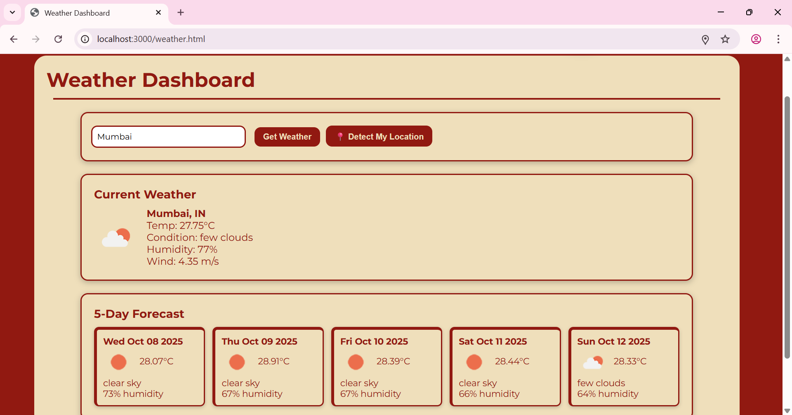
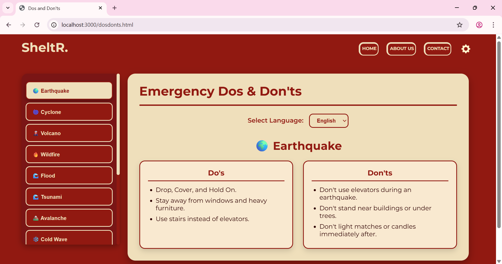
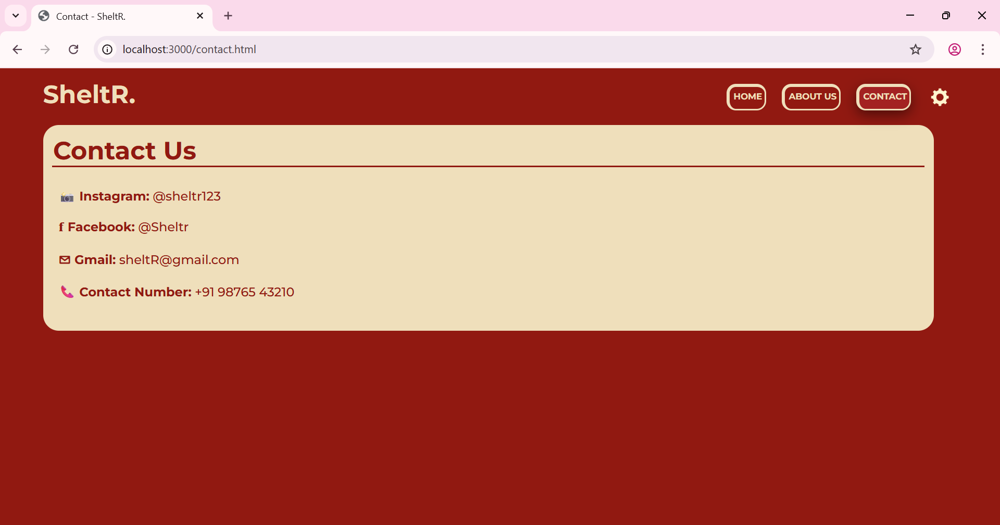
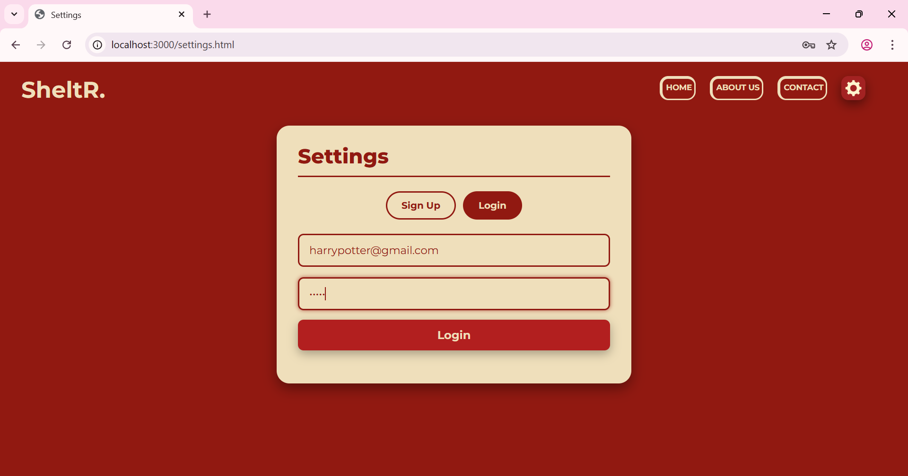

# SheltR-Disaster-Assistance-System
**SheltR** is a **Disaster Assistance System** that helps users find nearby safety facilities, view real-time weather and disaster updates, and access multilingual safety guidance during emergencies.

It bridges the gap between **authorities, responders, and the public**, ensuring that critical alerts and resources reach those who need them most.

By quickly delivering, the system empowers individuals seeking shelter or evacuating, helping to reduce harm and save lives.

By reducing communication delays and providing real-time updates, the system plays a vital role in saving lives, reducing damage, and maintaining order during life-threatening situations.

SheltR’s mission is to empower individuals and communities with immediate, accessible, and life-saving information during emergencies through innovative technology and real-time data integration.


> **Empowering communities with real-time disaster awareness and life-saving information.**

## 📑 Table of Contents
- [Features](#-features)
- [System Modules](#-system-modules)
- [Tech Stack](#-tech-stack)
- [Installation & Setup](#-installation--setup)
- [User Interface Screens](#🖥️-user-interface-screens)
- [Future Enhancements](#-future-enhancements)
- [Creators](#creators)
- [License](#-license)

## 🚀 Features

- **User Location Detection:** Uses browser geolocation APIs to detect user coordinates automatically. Provides manual input fallback (postal code or city) for users who deny permission. Stores user location for querying nearby safety facilities and alerts.

- **Range/Distance Filtering:** Allows users to specify a search radius (e.g., 2 km, 5km, 7 km) around their location. Uses geospatial database queries to filter facilities within the chosen distance. 

- **Facility Information:** Shows contact number(s), address (with map links), and current availability/capacity status for each listed facility. Updates availability data in real-time or via periodic admin inputs. 

- **Real-Time Weather Dashboard:** Displays current weather and warnings based on user input (pincode or lat-long). Integrates with OpenWeatherMap or similar APIs for detailed weather metrics. Shows temperature, precipitation, wind speed, and severe weather alerts. 

- **Global Recent Disaster Updates:** Fetches and displays recent global or regional disasters using ReliefWeb API. Provides event type, location, and time details.

- **Disaster Dos & Don’ts Dashboard:** Shows guidance content with safety instructions tailored to specific disaster types. Presents clear, easy-to-understand, and multi-lingual “dos & don’ts” to help users prepare or respond.

- **Multi-language Safety Guidance:** Comprehensive and clear dos & don’ts covered for 13 disaster types with trilingual support (English, Hindi, Gujarati).

- **Secure Authentication:** Email-based account creation with validation with secure token-based (JWT-based) authentication and bcrypt hashing for password security.

## 🧩 System Modules

- **Authentication Module:** Handles secure user registration, login, and session management using JWT tokens and bcrypt password hashing. Provides auto-login functionality and user profile management with simplified forms for emergency access.

- **Location Detection & Mapping Module:** Integrates browser geolocation and Nominatim geocoding for precise positioning. Uses Leaflet.js with OpenStreetMap tiles to display interactive maps with user locations and facility markers, including adjustable search radii and navigation features.

- **Facility Finder Module:** Locates and displays nearby emergency facilities (hospitals, shelters, fire stations) using real-time data from OpenStreetMap APIs. Shows contact information, availability status, and provides direct address to critical resources during emergencies. 

- **Dos & Don’ts Dashboard Module:** Provides safety guidance for 13 disaster types in English, Hindi, and Gujarati. Features clear “Dos/Don’ts” format with emoji-based visual categorization and tabbed navigation for quick access to emergency protocols.

- **Weather Dashboard Module:** Delivers real-time weather data and 5-day forecasts via OpenWeatherMap API. Displays current conditions, severe weather alerts, and forecasting information with intuitive icons and location-based weather intelligence.

- **Recent Disaster Updates Module:** Aggregates global disaster alerts from ReliefWeb API, showing real-time information on earthquakes, floods, storms, and other emergencies. Features categorized disaster listings with visual indicators and impact assessment data. 

- **Static Information Modules (About Us Module and Contact Module):** About Us provides mission and team information, while Contact offers support channels. Both maintain consistent branding and accessibility standards for organizational transparency and user support.

## 🛠 Tech Stack

| **Layer**                  | **Technology**                     | **Purpose** |
|------------------------|--------------------------------|---------|
| **Frontend**               | HTML5, CSS3, JavaScript (ES6+) | Build interactive & dynamic UI with API integration |
| **Backend**                | Node.js + Express.js            | API server, data management |
| **Database**               | MongoDB + Mongoose             | Stores user data |
| **Mapping & Location**     | OpenStreetMap + Leaflet.js      | Interactive maps and emergency facility visualization |
| **Geocoding**              | Nominatim API                  | Convert addresses to coordinates & vice versa |
| **Weather Data**           | OpenWeatherMap API             | Real-time weather & emergency forecasts |
| **Disaster Intelligence**  | ReliefWeb API                  | Global disaster & emergency updates |
| **Authentication**         | JWT + bcrypt                   | Secure user sessions & data protection |
| **Development Tools**      | Git + GitHub                   | Version control & team collaboration |
| **API Testing**            | Postman                        | API development & testing |
| **External Services**      | Browser Geolocation API         | Native device location detection |

<p align="center">
  <a href="https://nodejs.org/"></a>
  <a href="https://expressjs.com/"></a>
  <a href="https://www.mongodb.com/"></a>
  <a href="https://tailwindcss.com/"></a>
  <a href="https://jwt.io/"></a>
  <a href="https://git-scm.com/"></a>
  <a href="https://www.postman.com/"></a>
</p>

## 💻 Installation & Setup

### 1. Clone the Repository
```bash
git clone https://github.com/ManwaniDiksha/SheltR-Disaster-Assistance-System.git
cd SheltR-Disaster-Assistance-System
```

### 2. Install Backend Dependencies
```bash
cd backend
npm install
```

### 3. Configure Environment Variables
Create a `.env` file in the `backend` folder:
```env
PORT=3000
MONGO_URI=your_mongodb_connection_string
JWT_SECRET=your_jwt_secret
```

### 4. Start the Application
```bash
npm start
```

### 5. Access the Application
Open your browser and go to [http://localhost:3000](http://localhost:3000)

## 🖥️ User Interface Screens

### Landing Page
After running the server, the Landing Page is accessed with `http://localhost:3000/landingpage.html` and it has several buttons that lead to different modules.

<!-- Add: landing-page-screenshot.png -->


### Immediate Assistance Module
The 'Get Immediate Assistance' button leads to its Module which is accessed through `http://localhost:3000/emergency.html`

<!-- Add: emergency-module-screenshot.png -->


### Location Detection
After clicking on the 'Detect My Location' button, the browser's geolocation API throws a prompt for location permission.

<!-- Add: location-permission-screenshot.png -->


### Automatic Location Detection
After allowing localhost to access the user's location, the browser automatically detects the user's location and locates their device on the map with a 'You are here' prompt on a pin with the accurate location.

<!-- Add: automatic-location-screenshot.png -->


### Manual Location Input
The user's location can also be entered manually in the input textbox.

For instance, if 'Thaltej' is written in the textbox and the 'Set Location' button is clicked, the external geocoding API converts the location to the exact coordinates and locates the user on the map like it did for automatic location detection.

<!-- Add: manual-location-screenshot.png -->


### Nearby Facilities
Simultaneously, it displays a comprehensive list of nearby facilities like hospitals, fire stations, etc around the user's location within a distance of user's choice in the range of 7 KMs.

<!-- Add: nearby-facilities-screenshot.png -->


### Test Data - SheltR City
We have stored dummy data that is a fictional/made-up city called 'SheltR' for testing purposes.

When SheltR is entered in the textbox, the API translates the made up city into actual coordinates and shows made up facilities around those coordinates. In both automatic and manual location detection, a comprehensive list of facilities is shown with name, type, address, availability, and contact number.

<!-- Add: sheltR-test-data-screenshot.png -->


### Homepage Navigation
Using the browser's navigation, the user goes back to the landing page to explore the website further.

When the user clicks on the 'HOME' button in the navigation bar of the website, it leads the user to the home page which is a menu for the main modules of the website. The 'Immediate Emergency Assistance' can also be accessed from the homepage.

<!-- Add: homepage-screenshot.png -->


### Weather Dashboard
On clicking the navigation arrow in the 'Live Weather Dashboard' section, it leads the user to the weather webpage. On the user's entry to the webpage, it automatically detects the location of the user and displays its weather information. It displays 'Current Weather' and '5-day Forecast'.

<!-- Add: weather-dashboard-screenshot.png -->


### Automatic Weather Location
This is how automatic location works upon the user's entry to the webpage. Another way for the user to submit their location automatically to the backend is the 'Detect My Location' button. When the user clicks on it, it automatically detects the user's location and displays the weather information.

<!-- Add: automatic-weather-screenshot.png -->


### Manual Weather Input
Location can also be entered manually in the input textbox. And the weather of that location can be viewed by clicking on the 'Get Weather' button. For instance, in the picture below, the user enters Mumbai in the textbox and clicks on the 'Get Weather' button to access the weather of Mumbai.

<!-- Add: manual-weather-screenshot.png -->


### Weather Details
The 'Current Weather' section displays the city name and country initials and weather factors like temperature, condition, humidity, and wind speed of that city. The '5-day Forecast' section displays the next 5 five days and dates with temperature, condition, and humidity in that city for each day.

<!-- Add: weather-details-screenshot.png -->


### Recent Disasters Module
The user can navigate back to the home page by clicking on the 'HOME' button and access the Recent Disaster Module to view regular disaster updates.

After accessing the Recent Disasters Module through the navigation arrow, a list of recent disasters show up.

<!-- Add: recent-disasters-screenshot.png -->


### Disaster Information
For each disaster in the list, the name of the country where the disaster occurred, the type of disaster, the day and date of the occurrence and a bit of description about the disaster is displayed.

<!-- Add: disaster-details-screenshot.png -->


### Emergency Dos & Don'ts Module
The user can navigate back to the home page by clicking on the 'HOME' button and access the Emergency Dos & Don'ts Module to view essential dos and don'ts instructions during the time of emergency like disasters.

After accessing the Emergency Dos and Don'ts Module through the navigation arrow a list of types of disasters show up with the dos and don'ts instructions.

<!-- Add: dos-donts-list-screenshot.png -->


### Disaster Types
The list consists of 13 types of disasters. Clicking on any disaster would result in the essential dos & don'ts instructions for that disaster.

<!-- Add: disaster-types-screenshot.png -->


### Multi-language Support
Moreover, the instructions are available in 3 languages which are English, Hindi, and Gujarati. The user can choose between these languages by selecting one of them in the 'Select Language' dropdown.

The 'Select Language' dropdown menu gives 3 options to the user, if the user chooses English language, the dos & don'ts instructions are displayed in English.

<!-- Add: english-language-screenshot.png -->


If the user chooses Hindi language, the dos & don'ts instructions are displayed in Hindi.

<!-- Add: hindi-language-screenshot.png -->


If the user chooses Gujarati language, the dos & don'ts instructions are displayed in Gujarati.

<!-- Add: gujarati-language-screenshot.png -->


### About Us Section
The user can navigate back to the home page by clicking on the 'HOME' button and access the About Us section by clicking on the 'ABOUT US' button in the navigation bar.

Clicking on the 'ABOUT US' button in the navigation bar will result in the static About Us section webpage.

The About Us section consists of information about SheltR. It has sub-sections like 'Our Mission', 'What We Do', and 'Why Choose Sheltr.?'

<!-- Add: about-us-screenshot.png -->


### Contact Section
The user can navigate back to the home page by clicking on the 'HOME' button and access the Contact section by clicking on the 'CONTACT' button in the navigation bar.

Clicking on the 'CONTACT' button in the navigation bar will result in the static contact section webpage which has various social media and contact details.

<!-- Add: contact-section-screenshot.png -->


### Settings & Authentication
The user can navigate back to the home page by clicking on the 'HOME' button and access the Settings section by clicking on the button with the settings/gear symbol in the navigation bar.

Clicking on the gear button in the navigation bar will result in the Settings section webpage which has the authentication functionality for authenticating the user. By default the Sign Up section is opened.

<!-- Add: signup-section-screenshot.png -->


### Sign Up Validation
The Sign Up section is for registering a new user. It has a full name, email, and password as the input fields. It has various validations for instance, if a user doesn't add '@' in the email address then it will throw a prompt asking the user to include '@'.

It also has validation for empty fields. If the user doesn't fill out all the fields and clicks the 'Sign Up' button in order to register, the user will see a prompt that says 'All fields are required'.

<!-- Add: validation-screenshot.png -->


### Successful Registration
After the user successfully enters all the fields in the correct format and clicks the 'Sign Up' button, the user will see a prompt that says 'User registered successfully'.

The 'User registered successfully' prompt means that the user is registered and the user's details are stored in the database.

<!-- Add: registration-success-screenshot.png -->


### Login Section
Next, the user can click on the 'Login' tab to access the login section webpage in order to log into the website and view their profile.

<!-- Add: login-section-screenshot.png -->


### User Profile
The Login section has the same validations and once the user enters the correct credentials (email and password) and clicks on the 'Login' button the webpage displays the profile which has a 'Welcome' message along with the username entered during registration, the user's entered email address and a 'Logout' button.

<!-- Add: user-profile-screenshot.png -->


### Logout Functionality
If the 'Logout' button is clicked, the page goes back to the default Sign Up section which represents the logging out of the user's profile.

<!-- Add: logout-screenshot.png -->
